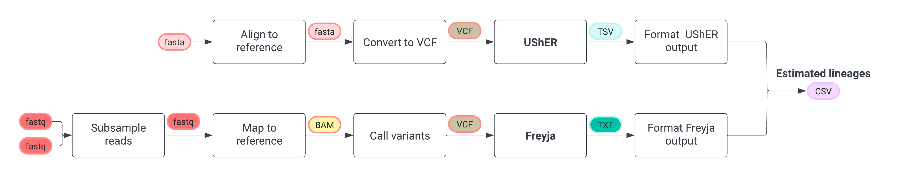

<p align="center">
    <picture>
      <source media="(prefers-color-scheme: dark)" srcset=".github/vibecheck_logo_dark.png">
      <source media="(prefers-color-scheme: light)" srcset=".github/vibecheck_logo_light.png">
      
    </picture>
</p>

This repository contains an easy-to-use program to assign O1 *Vibrio cholerae* genomes to [canonical lineages](https://doi.org/10.1126/science.aad5901) using phylogenetic placement.  

## Table of Contents
1. [Introduction](#introduction)
2. [How it Works](#how-it-works)
3. [Installation](#installation)
4. [Updating](#updating)
5. [Usage](#usage)
6. [Output](#output)

# Introduction
Genomic surveillance of cholera has identified at least three waves of global transmission from Asia to Africa during 
the seventh pandemic (7PET), and at least 17 independent introductions of 7PET into Africa (deemed the T1-T17 lineages). 
These lineages have been used to connect apparently disparate outbreaks, characterize regional transmission patterns, 
and suggested possible transmission routes of cholera within Africa. 
As well, genomic differences between lineages might explain differences in severity and transmissibility observed between different outbreaks.
Vibecheck enables the rapid assignment of sequences to these canonical lineages, as an alternative to a lengthy and 
computationally intensive reconstruction of the global phylogeny. 

# How it works
> [!NOTE]
> The sequence-based classification performed by Vibecheck is basically a fork of [Pangolin](https://github.com/cov-lineages/pangolin) (and accompanying [paper](https://doi.org/10.1093/ve/veab064)), in which the QC and hashing steps are removed, and an O1 _Vibrio cholerae_ global phylogeny is used.
> Therefore, we'd like to thank Áine O'Toole, Verity Hill, JT McCrone, Emily Scher and Andrew Rambaut for creating such a great and open-source tool.

<p align="center">
    <picture>
      
    </picture>
</p>

Vibecheck is a tool that identifies which canonical O1 _Vibrio cholerae_ lineage a sequence belongs to. It processes both:

- Consensus genomes (fasta format)
- Raw sequencing reads (fastq format)

The tool automatically selects the appropriate analysis workflow based on your input type.

## Sequence-based classification
When provided with a multi-sequence fasta containing whole genome sequences, generated either by reference-based or _de novo_ assembly,
Vibecheck: 

1. Aligns all input sequences against an early reference O1 _Vibrio cholerae_ genome. 
Vibecheck generates the alignment using [minimap2](https://github.com/lh3/minimap2) to map sequences again the reference and generates a multi-sequence fasta from the mapping using [gofasta](https://github.com/virus-evolution/gofasta).
2. Run each sequence through a QC check that reports the proportion of each sequence that is ambiguous characters. 
Any sequences that fail this check will not get assigned a lineage.
3. Identifies SNP differences between each sequence and the reference (i.e. variants) and generates a VCF file summarizing the variants using UCSC's [faToVcf](https://github.com/ucscGenomeBrowser/kent/tree/master) script.
4. Places each sequence into a lineage-annotated phylogeny using [UShER](https://github.com/yatisht/usher), and records whether the placement is contained within a lineage.
5. Parses the output of UShER, calculates the confidence in each lineage estimation, and produces a final lineage report.

## Read-based classification
When provided with a pair of fastq files representing the raw sequencing data for a sample, Vibecheck:

1. Randomly subsamples 20% of reads using [seqtk](https://github.com/lh3/seqtk) to ease computational demands and speed-up the analysis.
2. Aligns all input sequences against an early reference O1 _Vibrio cholerae_ genome using [minimap2](https://github.com/lh3/minimap2).
3. Calls variants present in the reads against the alignment using [BCFtools](https://github.com/samtools/bcftools).
4. Estimates the relative abundance of each lineage from the variant frequencies in the sample using [Freyja](https://github.com/andersen-lab/Freyja/).
5. Parsed the output of Freyja, calculates the confidence in the lineage estimate, and produces a final lineage report.

Validation of Vibecheck showed that it was >98% accurate in recapitulating the lineages of sequences left out of the guide tree.
See the [calculate_accuracy](notebooks/calculate_accuracy.ipynb) notebook for the complete validation of the speed and accuracy of Vibecheck. 
See also the [ambiguity_thresholding](notebooks/ambiquity_thresholding.ipynb) notebook for the empirical basis of our default maximum ambiguous parameter.

# Installation
1. Install `mamba` by running the following two command:
```commandline
curl -L -O "https://github.com/conda-forge/miniforge/releases/latest/download/Mambaforge-$(uname)-$(uname -m).sh"
bash Mambaforge-$(uname)-$(uname -m).sh
```

2. Clone the vibecheck repository:
```commandline
git clone https://github.com/CholGen/vibecheck.git
```

3. Move to the repository:
```commandline
cd vibecheck/
```

3. Install and activate the vibecheck's conda environment:
```commandline
mamba env create -f environment.yaml
mamba activate vibecheck
```

4. Install the `vibecheck` command:
```commandline
pip install .
```

5. Test the installation:
```commandline
vibecheck -h
vibecheck -v
```
These command should print the help and version of the program. Please create an issue if this is not the case.

# Updating

1. Navigate to the directory where you cloned the vibecheck repository on the command line:
```commandline
cd vibecheck/
```
2. Activate the vibecheck conda environment:
```commandline
mamba activate vibecheck
```
3. Pull the latest changes from GitHub:
```commandline
git pull
```
4. Update the vibecheck conda environment:
```commandline
mamba env update -f environment.yaml
```
5. Reinstall the `vibecheck` command:
```commandline
pip install .
```

# Usage
1. Activate the vibecheck conda environment:
```commandline
mamba activate vibecheck
```
2. Run
```commandline
vibecheck [query ...]
```
Where `[query ...]` is the name of your input fasta file or a pair of fastq files. 
A query fasta file can contain as many sequences as you would like to be classified, while paired fastq files should 
only contain the data for one sample.

This command will generate a CSV file (`lineage_report.csv`) containing the estimated lineages for each sequence in the query file. 
See [Output](#output) for a complete description of this file.

> [!ATTENTION]

## Full usage options
```
usage: vibecheck [-h] [-o OUTDIR] [--outfile OUTFILE] [--tempdir TEMPDIR] [--no-temp] [-t THREADS] [-v] [-u USHER_TREE] [-m MAX_AMBIGUITY] [-b BARCODES] [-s SUBSAMPLE] [--no-subsample] [query ...]

██╗   ██╗██╗██████╗ ███████╗ ██████╗██╗  ██╗███████╗ ██████╗██╗  ██╗
██║   ██║██║██╔══██╗██╔════╝██╔════╝██║  ██║██╔════╝██╔════╝██║ ██╔╝
██║   ██║██║██████╔╝█████╗  ██║     ███████║█████╗  ██║     █████╔╝ 
╚██╗ ██╔╝██║██╔══██╗██╔══╝  ██║     ██╔══██║██╔══╝  ██║     ██╔═██╗ 
 ╚████╔╝ ██║██████╔╝███████╗╚██████╗██║  ██║███████╗╚██████╗██║  ██╗
  ╚═══╝  ╚═╝╚═════╝ ╚══════╝ ╚═════╝╚═╝  ╚═╝╚══════╝ ╚═════╝╚═╝  ╚═╝

        Rapid classification of O1 Vibrio cholerae lineages.

positional arguments:
  query                 Query sequences to classify

options:
  -h, --help            show this help message and exit
  -o OUTDIR, --outdir OUTDIR
                        Output directory. Default: current working directory
  --outfile OUTFILE     Optional output file name. Default: lineage_report.csv
  --tempdir TEMPDIR     Specify where you want the temp stuff to go. Default: $TMPDIR
  --no-temp             Output all intermediate files, for dev purposes.
  -t THREADS, --threads THREADS
                        Number of threads to use when possible. Default: all available cores, 4 detected on this machine
  -v, --version         Prints the version of Vibecheck and exits.

Sequence-based classification:
  -u USHER_TREE, --usher-tree USHER_TREE
                        UShER Mutation Annotated Tree protobuf file to use instead of default tree
  -m MAX_AMBIGUITY, --max-ambiguity MAX_AMBIGUITY
                        Maximum number of ambiguous bases a sequence can have before its filtered from the analysis. Default: 0.3

Read-based classification:
  -b BARCODES, --barcodes BARCODES
                        Feather formatted lineage barcodes to use instead of default O1 barcodes
  -s SUBSAMPLE, --subsample SUBSAMPLE
                        Fraction of reads to use in classification. Default: 0.2
  --no-subsample        Do not subsample reads. Default: False

```

# Output
A successful run of Vibecheck will output a CSV file, named by default `lineage_report.csv`.

This output file contains 6 columns with a row for each sequence found in the query input file.
- The `sequence_id` column contains the name of each provided sequence.
- The `qc_status` column indicates whether a sequenced passed or failed quality control.
- The `qc_notes` columns summarizes the results the quality control process.
- The `lineage` column contains the most likely lineage assigned to a sequence.
- The `confidence` column contains a value reflecting how confidence the assignment of a sequence is. 
A value of 0 indicates, given the current phylogenetic tree, there is only a single lineage that the sequence could be assigned to, while a value above 0 indicates that number of lineages that a sequence could be assigned to.
- The `classification_notes` column summarizes the placement(s) of a sequences. 

> [!NOTE]
> The assignment of a sequence is sensitive to missing data at key sites, recombination, and other factors. 
> Therefore, caution should be taken in interpreting the results of Vibecheck. 
> All results should be confirmed with a complete phylogenetic reconstruction involving quality and completeness filtering, and recombination masking.
> We recommend the [bacpage phylogeny](https://github.com/CholGen/bacpage) (available on [Terra](https://dockstore.org/workflows/github.com/CholGen/bacpage/bacpage-phylogeny) as well) pipeline for this.

## Example output

| sequence_id | qc_status | qc_notes                | lineage | confidence | usher_note                                |
|-------------|-----------|-------------------------|---------|------------|-------------------------------------------|
| _SequenceA_ | pass      | Ambiguous_content:0.01% | T13     | 1.0        | Usher placements: T13(1/1)                |
| _SequenceB_ | pass      | Ambiguous_content:0.03% | T15     | 1.0        | Usher placements: T15(1/1)                |
| _SequenceC_ | pass      | Ambiguous_content:0.02% | T12     | 1.0        | Usher placements: T12(8/8)                |
| _SequenceD_ | pass      | Ambiguous_content:0.13% | T13     | 0.6666     | Usher placements: T13(2/3) UNDEFINED(1/3) |

In the example above, _SequenceA_ and _SequenceB_ each have a single parsimonious placement in the phylogeny and are therefore assigned T13 and T15, respectively, with a confidence value of 1 indicating low uncertainty.
_SequenceC_ has eight parsimonious placements in the phylogeny (as indicated by the `(8/8)` in the `classification_notes` column). 
However, all of these placements are in the T12 lineage. Therefore, _SequenceC_ is assigned the lineage T12 with a confidence value of 1 indicating high certainty.
_SequenceD_ has three parsimonious placements in the phylogeny, two of which fall in the T13 lineage, and one which falls into non-African diversity.
SequenceD is therefore assigned as T13 because it is the most frequent assignment, but it has a confidence value less than 1 indicating an uncertain assignment. 
The quality and completeness of this sequence should be confirmed, and a complete phylogenetic construction should be completed to confirm the lineage assignment.
